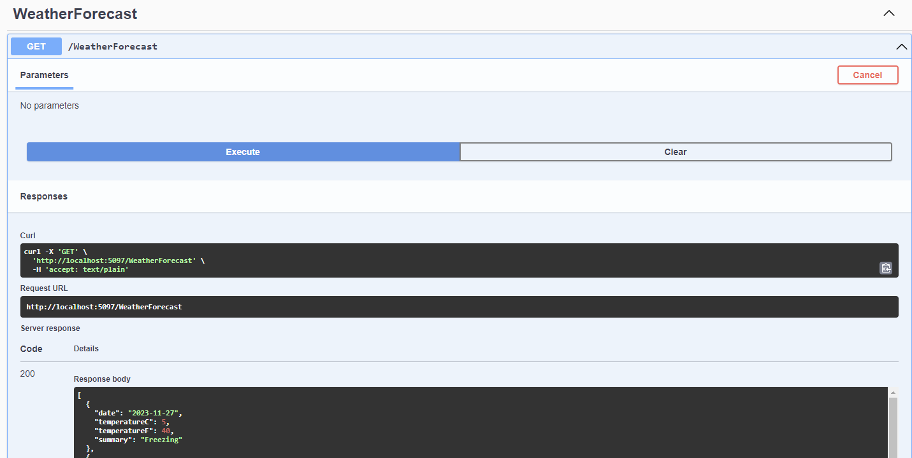

# SoftIssue-Core

## Description
SoftIssue-Core is a .NET 8 solution designed for building scalable web applications with a microservices architecture. The solution includes a WebAPI project for backend controllers, microservices in the Services directory, and a shared library for common functionalities.

### Project Structure
- **SoftIssue-Core/src/SoftIssue.sln**: The main solution file.
- **SoftIssue-Core/src/WebAPIs/MyAPI**: The WebAPI projects for exposing backend controllers.
- **SoftIssue-Core/src/Services/MyService**: Microservices projects.
- **SoftIssue-Core/src/SharedLibrary**: Shared library for common code.

## Prerequisites
- .NET 8 SDK
- VS Code, Rider, Visual Studio 2022 or a similar IDE that supports .NET 8

## Getting Started

### Clone the Repository
To get started, clone the repository to your local machine.
### Building the Solution
Navigate to the solution directory and build the solution:

```bash
git clone [repository-url]
```

```bash
cd SoftIssue-Core
dotnet build
```
### Running a WebAPI
To run a WebAPI project:

```bash
cd SoftIssueApi
dotnet run --project src/WebAPIs/SoftIssueApi
```
### Accessing Swagger UI
Once the WebAPI project is running, you can access the Swagger UI to interact with the API by navigating to http://localhost:{YourPort}/swagger in your web browser.
You can  test any of the endpoints by clicking on the endpoint and then clicking the "Try it out" button. You can then enter the required parameters and click the "Execute" button to test the endpoint.


### Adding a New Service
To add a new service:
Create a new project in the Services directory.

Add the new project to the solution file:
```bash
dotnet sln SoftIssue.sln add ./src/Services/NewService/NewService.csproj
```

Reference the SharedLibrary if needed:
```bash
dotnet add ./src/Services/NewService/NewService.csproj reference ./src/SharedLibrary/SharedLibrary.csproj
```
### Managing NuGet Packages
Adding a NuGet Package:
```bash
Copy code
dotnet add package [package-name]
```
### Restoring NuGet Packages:
```bash
Copy code
dotnet restore
```
## Contributing
Contributions to SoftIssue-Core are welcome. Please ensure you follow the coding standards and write necessary tests for new features.
